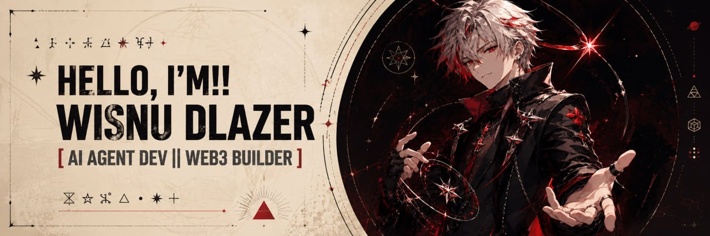

<div align="center">
  

  <br />
  <br />

  <a href="https://hitamlegam.top"></a>
  <a href="https://t.me/wisnudlazer"></a>
</div>

---

## Wisnu DLazer

Builder/operator focused on Web3 execution systems, mint tooling, automation, monitoring, and practical AI agents.

- **Web3 ops:** EVM mint workflows, allowlist/FCFS tooling, wallet automation, transaction monitoring
- **Automation:** bots, dashboards, alerting, Discord/Telegram utilities, temp-mail surfaces
- **AI tooling:** operator assistants, workflow agents, signal triage, research helpers
- **Infra:** VPS ops, deployments, API integrations, observability, fast iteration loops

---

## Active Surfaces

| Surface | Link | Notes |
| --- | --- | --- |
| HitamLegam | [hitamlegam.top](https://hitamlegam.top) | Web3 execution desk + tools hub |
| Temp Mail | [mail.hitamlegam.top](https://mail.hitamlegam.top) | Disposable inbox utility |
| Discord | [Join](https://discord.gg/4txhucSua2) | Community / ops channel |

---

## Stack

<p align="center">
  
</p>

---

## Current Focus

```txt
> ship useful surfaces
> remove noise
> keep receipts
```

- EVM mint bot tooling
- Signal feeds and monitoring
- AI-assisted ops workflows
- Lightweight dashboards and utilities

---

<div align="center">
  
  <br />
  
</div>
